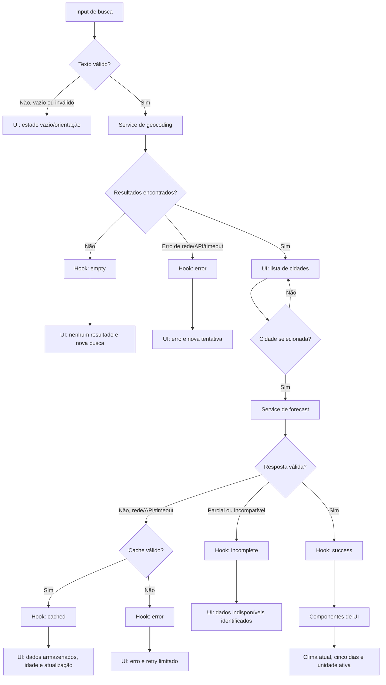

# Plano Técnico — Weather App

Fonte da verdade: `specs/weather-app-spec.md`.

Este plano define decisões técnicas e contratos para o MVP. Não contém a implementação final.

## Architecture

- Aplicação React client-side organizada em camadas com dependências unidirecionais: `components` -> `hooks` -> `services`/`lib` -> `types`.
- `components/` é a camada de apresentação: renderiza dados e estados, dispara eventos de usuário e mantém semântica, teclado e acessibilidade. Não conhece URLs, `fetch`, payloads Open-Meteo, cache ou regras de concorrência.
- `hooks/` é a camada de orquestração: coordena busca, seleção explícita, consulta de forecast, cancelamento, identificador de requisição, retry, cache e transições de estado. Expõe um contrato orientado à UI.
- `services/` é a camada de acesso a dados: encapsula HTTP, endpoints, timeout, `AbortController`, parsing, validação de payload externo e transformação para o modelo interno. Não renderiza componentes nem gerencia estado React.
- `lib/` contém funções puras: normalização de texto, ranking, conversão de unidade, mapeamento WMO, validação e formatação. Não faz rede, não acessa DOM e não depende de hooks.
- `types/` define contratos compartilhados entre as camadas, incluindo `City`, `CurrentWeather`, `ForecastDay`, `WeatherData` e `Unit`.
- `App.tsx` apenas compõe a tela e conecta o hook aos componentes; `main.tsx` inicializa o React.
- Os fluxos de geocoding e weather são independentes, com no máximo uma execução ativa por operação. Uma nova busca invalida a anterior.
- A UI mantém cinco posições de previsão; períodos inválidos são apresentados como indisponíveis, sem dados inventados.

Essa separação reduz acoplamento: a UI pode mudar sem alterar a integração, a API pode ser substituída sem reescrever componentes e regras críticas podem ser testadas como funções determinísticas. Os testes de serviço usam mocks de `fetch`, os testes de hook usam serviços falsos e os testes de componentes verificam apenas interação, estados e acessibilidade.
- Fora do escopo: backend, autenticação, persistência, geolocalização, favoritos, histórico, previsão horária e offline garantido.

## Tech Stack

- React 19, TypeScript strict e Vite.
- Tailwind CSS 3 para o tema dark glassmorphism e layout mobile-first.
- `fetch` nativo com `AbortController`; nenhuma dependência HTTP nova.
- Vitest e Testing Library para regras, serviços e componentes.
- Playwright para fluxos E2E.
- Biome e pnpm conforme o `package.json`.
- `Intl` com locale `pt-BR` para datas, horários e números.
- Validação manual de payloads, sem adicionar biblioteca de schema no MVP.

## Project Structure

```text
src/
├── components/
│   ├── SearchForm.tsx              # campo e envio da busca
│   ├── LocationResults.tsx         # resultados selecionáveis
│   ├── UnitToggle.tsx              # seleção Celsius/Fahrenheit
│   ├── CurrentWeather.tsx           # clima atual
│   ├── ForecastList.tsx              # cinco dias de previsão
│   ├── WeatherAttribution.tsx       # atribuição Open-Meteo
│   └── states/
│       ├── InitialState.tsx          # estado antes da primeira busca
│       ├── LoadingState.tsx          # carregamento
│       ├── EmptyState.tsx            # sem resultados ou dados
│       ├── ErrorState.tsx            # falha recuperável
│       ├── CachedState.tsx           # dados armazenados após falha
│       └── IncompleteState.tsx       # payload parcialmente utilizável
├── hooks/
│   └── useWeather.ts                # estado e orquestração do fluxo
├── services/
│   ├── openMeteoClient.ts            # transporte HTTP e erros externos
│   ├── geocodingService.ts           # busca e normalização de cidades
│   └── weatherService.ts             # consulta e normalização do forecast
├── lib/
│   ├── normalization.ts              # texto, ranking e chaves
│   ├── weather.ts                    # conversão, WMO e regras meteorológicas
│   └── formatting.ts                 # Intl, datas e números pt-BR
├── types/
│   └── weather.ts                    # contratos do domínio e operações
├── styles/
│   └── index.css                     # Tailwind e estilos globais
├── App.tsx                           # composição da aplicação
└── main.tsx                          # bootstrap React

tests/               # testes unitários, integração e E2E
```

Regras de dependência:

- `components` pode importar `hooks`, `types` e funções de apresentação de `lib`, mas nunca `openMeteoClient` diretamente.
- `hooks` pode importar `services`, `lib` e `types`, mas não deve conter JSX de apresentação.
- `services` pode importar `lib` e `types`; o cliente HTTP não depende de React.
- `lib` importa somente tipos e APIs padrão do ambiente.
- `types` não importa nenhuma camada de execução.

Essa estrutura permite testar `lib` sem ambiente de navegador, testar `services` com respostas `fetch` simuladas, testar `useWeather` com dependências injetadas e testar componentes com um hook/serviço falso, sem depender da rede real.

## Data Model

Os nomes dos identificadores são em inglês; as mensagens e a documentação da aplicação são em pt-BR. Os nomes abaixo mapeiam os campos da Open-Meteo para o modelo interno em `camelCase`.

```ts
export type Unit = 'celsius' | 'fahrenheit'

export interface City {
  /** Identificador estável retornado pelo geocoding */
  id: number
  /** Nome da cidade */
  name: string
  /** Latitude da localidade */
  latitude: number
  /** Longitude da localidade */
  longitude: number
  /** Nome do país */
  country: string
  /** Código ISO do país */
  countryCode: string
  /** Estado ou região administrativa */
  region?: string
  /** Fuso horário IANA retornado pela Open-Meteo */
  timezone?: string
}

export interface CurrentWeather {
  /** Data e hora local retornadas pela API */
  time: string
  /** Temperatura atual em Celsius */
  temperatureCelsius: number
  /** Sensação térmica em Celsius */
  apparentTemperatureCelsius?: number
  /** Umidade relativa do ar em porcentagem */
  relativeHumidity?: number
  /** Código meteorológico WMO */
  weatherCode: number
}

export interface ForecastDay {
  /** Data local no formato ISO YYYY-MM-DD */
  date: string
  /** Temperatura mínima em Celsius */
  temperatureMinCelsius: number
  /** Temperatura máxima em Celsius */
  temperatureMaxCelsius: number
  /** Código meteorológico WMO do dia */
  weatherCode: number
}

export interface WeatherData {
  /** Cidade usada na consulta */
  city: City
  /** Fuso horário usado para interpretar datas e horários */
  timezone: string
  /** Condições meteorológicas atuais */
  current: CurrentWeather
  /** Previsão do dia atual e dos quatro dias seguintes */
  forecast: [ForecastDay, ForecastDay, ForecastDay, ForecastDay, ForecastDay]
  /** Momento em que os dados foram obtidos */
  fetchedAt: number
}

export type PublicError = {
  kind: 'network' | 'timeout' | 'http' | 'invalid-response' | 'unknown'
  message: string
}

export type OperationState<T> = {
  status: 'idle' | 'loading' | 'success' | 'empty' | 'error' | 'incomplete' | 'cached'
  data?: T
  error?: PublicError
  retryCount: number
  cache?: {
    fetchedAt: number
    ageMs: number
  }
}
```

- Payloads externos da Open-Meteo são tipos privados de transporte e não atravessam a fronteira do serviço.
- O serviço valida tipos, arrays, cardinalidade, datas ISO locais, finitude, faixas plausíveis e timezone antes de produzir o modelo interno.
- Os campos de temperatura do modelo interno permanecem em Celsius. Fahrenheit é derivado somente na apresentação pela fórmula `F = C * 9 / 5 + 32`, com arredondamento inteiro consistente.
- `City` mapeia `admin1` para `region`, `country_code` para `countryCode` e preserva `timezone` quando fornecido pelo geocoding.
- `CurrentWeather` mapeia `current.temperature_2m`, `current.apparent_temperature`, `current.relative_humidity_2m` e `current.weather_code`.
- `ForecastDay` mapeia `daily.time`, `daily.temperature_2m_min`, `daily.temperature_2m_max` e `daily.weather_code`.

## Data Flow

1. `SearchForm` normaliza espaços, acentos e caixa; entrada vazia ou inválida encerra localmente sem `fetch`.
2. `useWeather` cria um `operationId` e um `AbortController`, cancela a busca anterior e solicita geocoding.
3. `geocodingService` chama a API com até dez resultados, valida, remove duplicatas e ordena por correspondência textual e contexto regional.
4. `LocationResults` exibe cidade, região e país. Nenhuma localidade é escolhida implicitamente.
5. Ao selecionar uma localidade, o hook cria uma nova operação de weather, invalida respostas antigas e consulta o forecast para as coordenadas selecionadas.
6. `weatherService` valida o timezone retornado, deriva cinco datas locais consecutivas começando no dia local atual e normaliza os dados.
7. O hook publica sucesso ou incompleto, registra `fetchedAt` e armazena o resultado em cache. A UI usa `Intl` e a unidade ativa para renderizar.
8. Uma resposta só altera o estado se seu `operationId` ainda for o ativo. Aborts e respostas obsoletas são ignorados.



## External APIs

### Geocoding

- Endpoint: `https://geocoding-api.open-meteo.com/v1/search`.
- Parâmetros: `name`, `count=10`, `language=pt` e `format=json`.
- Resultado mínimo: identificador estável, nome, latitude, longitude e país; região e timezone quando disponíveis.

Exemplo resumido de resposta:

```json
{
  "results": [
    {
      "id": 3451190,
      "name": "Sao Paulo",
      "latitude": -23.55,
      "longitude": -46.63,
      "country": "Brazil",
      "country_code": "BR",
      "admin1": "Sao Paulo",
      "timezone": "America/Sao_Paulo"
    }
  ],
  "generationtime_ms": 0.4
}
```

Mapeamento para `City`:

| Open-Meteo | Modelo | Regra |
| --- | --- | --- |
| `id` | `id` | Preservar como identificador estável. |
| `name` | `name` | Preservar o nome retornado. |
| `latitude` | `latitude` | Validar número finito e faixa `-90..90`. |
| `longitude` | `longitude` | Validar número finito e faixa `-180..180`. |
| `country` | `country` | Preservar o país para exibição. |
| `country_code` | `countryCode` | Converter apenas o nome para `camelCase`. |
| `admin1` | `region` | Usar como contexto regional quando existir. |
| `timezone` | `timezone` | Preservar o fuso IANA quando existir. |

### Forecast

- Endpoint: `https://api.open-meteo.com/v1/forecast`.
- Parâmetros: latitude, longitude, `timezone=auto`, `forecast_days=5`, `temperature_unit=celsius`.
- Campos `current`: `temperature_2m`, `apparent_temperature`, `relative_humidity_2m` e `weather_code`.
- Campos `daily`: `temperature_2m_min`, `temperature_2m_max` e `weather_code`.

Consulta resumida:

```text
https://api.open-meteo.com/v1/forecast
  ?latitude=-23.55
  &longitude=-46.63
  &current=temperature_2m,apparent_temperature,relative_humidity_2m,weather_code
  &daily=temperature_2m_min,temperature_2m_max,weather_code
  &timezone=auto
  &forecast_days=5
  &temperature_unit=celsius
```

Exemplo resumido de resposta:

```json
{
  "timezone": "America/Sao_Paulo",
  "current": {
    "time": "2026-09-16T14:00",
    "temperature_2m": 22.4,
    "apparent_temperature": 22.1,
    "relative_humidity_2m": 65,
    "weather_code": 2
  },
  "daily": {
    "time": ["2026-09-16", "2026-09-17", "2026-09-18", "2026-09-19", "2026-09-20"],
    "temperature_2m_min": [16.2, 17.0, 18.1, 17.5, 16.8],
    "temperature_2m_max": [24.8, 25.2, 26.0, 23.9, 24.5],
    "weather_code": [2, 3, 61, 3, 1]
  },
  "current_units": {
    "temperature_2m": "°C",
    "apparent_temperature": "°C",
    "relative_humidity_2m": "%"
  }
}
```

Parâmetros e mapeamento para o modelo:

| Parâmetro/campo | Finalidade |
| --- | --- |
| `latitude`, `longitude` | Identificam a `City` selecionada. |
| `current` | Solicita os campos usados para construir `CurrentWeather`. |
| `daily` | Solicita as séries usadas para construir os cinco `ForecastDay`. |
| `timezone=auto` | Faz a API retornar horário e datas no fuso da coordenada. |
| `forecast_days=5` | Solicita exatamente o dia atual e os quatro seguintes. |
| `temperature_unit=celsius` | Mantém o modelo interno em Celsius; a UI converte para Fahrenheit. |
| `timezone` | Mapeia para `WeatherData.timezone` e deve ser validado contra as datas locais. |
| `current.time` | Mapeia para `CurrentWeather.time`. |
| `current.temperature_2m` | Mapeia para `CurrentWeather.temperatureCelsius`. |
| `current.apparent_temperature` | Mapeia para `CurrentWeather.apparentTemperatureCelsius`. |
| `current.relative_humidity_2m` | Mapeia para `CurrentWeather.relativeHumidity`. |
| `current.weather_code` | Mapeia para `CurrentWeather.weatherCode`. |
| `daily.time[i]` | Mapeia para `ForecastDay.date`. |
| `daily.temperature_2m_min[i]` | Mapeia para `ForecastDay.temperatureMinCelsius`. |
| `daily.temperature_2m_max[i]` | Mapeia para `ForecastDay.temperatureMaxCelsius`. |
| `daily.weather_code[i]` | Mapeia para `ForecastDay.weatherCode`. |

As séries `daily.*` devem ter o mesmo tamanho, conter cinco posições, possuir datas únicas e estar em ordem crescente. A resposta deve ser rejeitada ou marcada como incompleta quando essas condições não forem atendidas.

O adaptador centraliza URL, `fetch`, timeout de 10 segundos, `AbortController`, verificação de `response.ok`, parsing JSON e validação estrutural.

Códigos WMO recebem descrição textual em pt-BR e texto acessível. Código desconhecido não deve quebrar os demais campos e deve ser tratado como condição indisponível.

A atribuição da Open-Meteo fica visível na tela principal, sem bloquear o fluxo principal.

## State Management

- O estado vive no hook `useWeather`, próximo do fluxo que o modifica e compartilhado somente com os componentes da tela por seu retorno. Não usar Redux, Context global, localStorage ou persistência.
- O hook mantém estados independentes para `geocoding` e `weather`, evitando que uma falha meteorológica impeça uma nova busca de cidade.
- Cada operação expõe um estado base explícito: `idle`, `loading`, `success`, `empty` ou `error`.
  - `idle`: nenhuma operação foi iniciada ou o resultado anterior foi limpo.
  - `loading`: há uma requisição ativa; ações duplicadas ficam desabilitadas.
  - `success`: a resposta foi validada e os dados necessários estão disponíveis.
  - `empty`: a busca terminou sem resultados, sem iniciar forecast.
  - `error`: a operação falhou e possui erro público para exibição e retry quando aplicável.
- Para o weather, `incomplete` identifica dados parciais sem valores inventados e `cached` identifica uma resposta válida servida após falha. Eles são estados de apresentação derivados do resultado da operação, não novos fluxos de rede.
- Transições principais: `idle -> loading -> success | empty | error`; `error -> loading` ocorre apenas por ação manual de retry; uma nova busca sempre inicia uma nova operação.
- `retryCount` pertence somente à operação de weather atual. Um erro de weather permite até duas novas ações manuais; após o limite, a busca permanece disponível e não há retry automático.
- A unidade inicial é `celsius`. O estado `unit: Unit` vive no hook ou no componente de tela durante a sessão e não altera request, cache, localidade ou dados internos.
- Os valores armazenados em `WeatherData` permanecem em Celsius. Na renderização, uma função pura recebe o valor Celsius e a unidade ativa: `C -> C` ou `C -> (C * 9 / 5) + 32`; o resultado é arredondado ao inteiro mais próximo e recebe o sufixo `°C` ou `°F`.
- A troca de unidade atualiza apenas a apresentação de temperatura atual, sensação térmica, mínimas e máximas. Datas, condições, umidade e estado da operação permanecem inalterados e nenhum novo request é feito.
- O cache é um `Map<WeatherCacheKey, CacheEntry>` em memória, com chave por localidade, timezone e janela, e validade máxima de 30 minutos. Em erro ou timeout, uma entrada válida pode virar `cached` com horário e idade; cache expirado é descartado.

## Error Handling

- A camada de serviço converte falhas técnicas em um erro público estável (`PublicError`), enquanto a UI exibe mensagens em pt-BR sem stack trace, payload, credenciais ou detalhes internos.
- Input vazio ou inválido: validação local, mensagem orientativa e nenhuma chamada de rede.
- Sem resultados de geocoding: estado `empty`, sem iniciar forecast e mantendo o campo disponível para nova busca.
- Erro de rede: classificar como `network`, finalizar o loading e permitir retry manual da operação de weather quando ainda houver tentativas.
- Erro HTTP ou indisponibilidade da API: classificar como `api`/`http`, sem assumir que o payload contém dados utilizáveis. Exibir erro recuperável e preservar a busca.
- Timeout: usar `AbortController` após 10 segundos, classificar como `timeout`, encerrar o loading e permitir nova tentativa manual. Não fazer retry automático.
- Resposta JSON malformada ou incompatível: classificar como `invalid-response`; nunca publicar sucesso silencioso.
- Resposta parcial: campos complementares ausentes, como sensação térmica ou umidade, não interrompem os demais dados válidos. A ausência de temperatura ou condição atual marca o clima atual como indisponível; a ausência de mínima, máxima ou condição afeta somente o período correspondente.
- Menos de cinco dias, datas duplicadas/fora de ordem, valores não finitos ou timezone incompatível produzem `incomplete` ou `error` identificável, sem preencher valores inventados.
- Falha de weather com cache válido pode exibir o cache em estado `cached`, com data/hora de atualização e idade. Cache expirado e cache de geocoding nunca são apresentados como clima atual.
- Respostas obsoletas e abortos não alteram o estado atual; o hook verifica o `operationId` antes de publicar qualquer resultado.
- Mensagens de loading, erro, vazio e cache usam live regions acessíveis; o foco deve permanecer previsível ou ser movido para o resultado da operação quando necessário.
- Observabilidade registra somente eventos agregados previstos na spec, duração, operação, status e erro sanitizado. Não registra busca bruta, coordenadas precisas, payloads ou dados pessoais. Transporte e retenção ficam fora do MVP frontend.

## Testing Strategy

### Vitest

- Funções puras em `lib/`: normalização de texto com acentos, espaços e caixa; ranking e desempate de cidades; conversão Celsius/Fahrenheit e arredondamento; mapeamento WMO; formatação `pt-BR`; validação de números, datas, timezone e derivação dos cinco dias.
- Services: mockar `fetch` para sucesso, lista vazia, erro HTTP, falha de rede, timeout, abort, JSON malformado, campos ausentes, datas duplicadas, datas fora de ordem e forecast com menos de cinco dias.
- Verificar parâmetros e URLs exatos enviados ao geocoding e forecast, além de garantir que payload externo inválido não atravesse a fronteira do serviço.
- Componentes com Testing Library: estado inicial/`idle`, `loading`, `empty`, `error`, `success`, `incomplete` e `cached`; verificar textos em pt-BR, roles, nomes acessíveis, live regions, foco e operação por teclado.
- Hook/orquestração: transições de estado, seleção explícita, retry limitado a duas novas tentativas, cache após falha, troca de unidade sem novo `fetch`, nova busca durante operação, cancelamento e resposta obsoleta ignorada.
- Usar serviços falsos ou mocks de módulo nos testes do hook para testar estado e concorrência sem rede real.

### Playwright

- Fluxo feliz: pesquisar cidade, selecionar resultado, visualizar clima atual e exatamente cinco dias.
- Busca: entrada vazia, cidade inexistente, lista ambígua, distinção por região/país e nova busca após resultado anterior.
- Resiliência: loading, erro de rede/API, timeout, retry, limite de duas tentativas, cache servido após falha e resposta atrasada que não pode sobrescrever a consulta atual.
- Unidade: alternar Celsius/Fahrenheit e confirmar que todos os valores visíveis mudam sem nova chamada de rede.
- Acessibilidade funcional: completar busca, selecionar cidade, alternar unidade e tentar novamente usando apenas teclado.
- Responsividade: executar nos viewports de 320, 768 e 1280 px; verificar legibilidade, ausência de sobreposição e ausência de rolagem horizontal para controles e cinco períodos.
- Interceptar requests no Playwright para usar fixtures determinísticas e evitar dependência da disponibilidade da Open-Meteo nos testes E2E.

### Verificação de entrega

- Executar `pnpm lint`, `pnpm build`, `pnpm test` e `pnpm test:e2e`.
- Medir manualmente o feedback de loading em até 200 ms e revisar contraste, foco visível e navegação por teclado.
- Manter testes unitários rápidos como primeira barreira; usar E2E para contratos entre camadas e comportamento observável, não para repetir cada regra já coberta no Vitest.

## Risks & Trade-offs

- A Open-Meteo pode alterar payloads, códigos ou latência. Adaptador isolado e validação reduzem o impacto, ao custo de manutenção dos guards.
- `timezone=auto` simplifica a integração, mas fronteiras de dia são sensíveis. Datas devem ser derivadas do retorno local e testadas em fusos extremos.
- `AbortController` não garante que toda resposta seja interrompida; `operationId` é obrigatório como segunda proteção.
- Cinco períodos sem rolagem horizontal em 320 px exigem layout compacto e reflow sem reduzir legibilidade ou acessibilidade.
- Cache em memória é simples e não vaza dados entre sessões, mas desaparece ao recarregar e não oferece offline.
- A validação manual reduz dependências, mas exige guards abrangentes e testes de payload inválido.
- A spec define observabilidade, mas não um destino de telemetria. O frontend deve expor eventos sanitizados por uma interface injetável, deixando transporte e retenção para infraestrutura futura.
- O mapeamento WMO deve permanecer centralizado e testado; códigos desconhecidos não devem produzir condição inventada.

### Trade-offs e alternativas consideradas

- `fetch` nativo foi escolhido em vez de Axios ou React Query: reduz dependências e é suficiente para duas APIs simples, mas exige implementar timeout, cancelamento, parsing e cache localmente.
- Validação manual foi escolhida em vez de Zod ou outra biblioteca de schema: mantém o bundle e o plano menores, mas exige guards explícitos e fixtures de payload inválido nos testes.
- Estado local no `useWeather` foi escolhido em vez de Redux, Context global ou Zustand: reduz cerimônia para uma única tela, mas exigiria revisão se o estado passasse a ser compartilhado por muitas rotas.
- Cache em memória foi escolhido em vez de localStorage, IndexedDB ou cache HTTP próprio: respeita a sessão e evita persistir dados, mas perde o cache ao recarregar e não oferece offline.
- Celsius como unidade da API foi escolhido em vez de solicitar a unidade ativa ao forecast: permite alternar instantaneamente sem nova requisição e mantém uma única fonte de verdade, ao custo de converter na apresentação.
- Vitest com mocks foi escolhido em vez de depender da Open-Meteo em testes: fornece determinismo e velocidade, mas não detecta sozinho mudanças reais no contrato remoto; a consulta e o adaptador devem ser revisados periodicamente.
- Playwright com requests interceptados foi escolhido em vez de E2E contra a API real: evita flakiness e limites externos, mas requer fixtures que representem cenários reais e um smoke test manual ou separado de integração.
- Uma interface de telemetria injetável foi escolhida em vez de analytics identificável: preserva privacidade e deixa o destino configurável, mas não entrega retenção e dashboards dentro do MVP.
